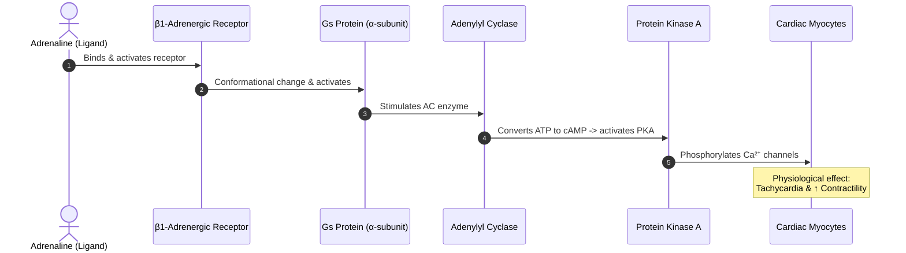
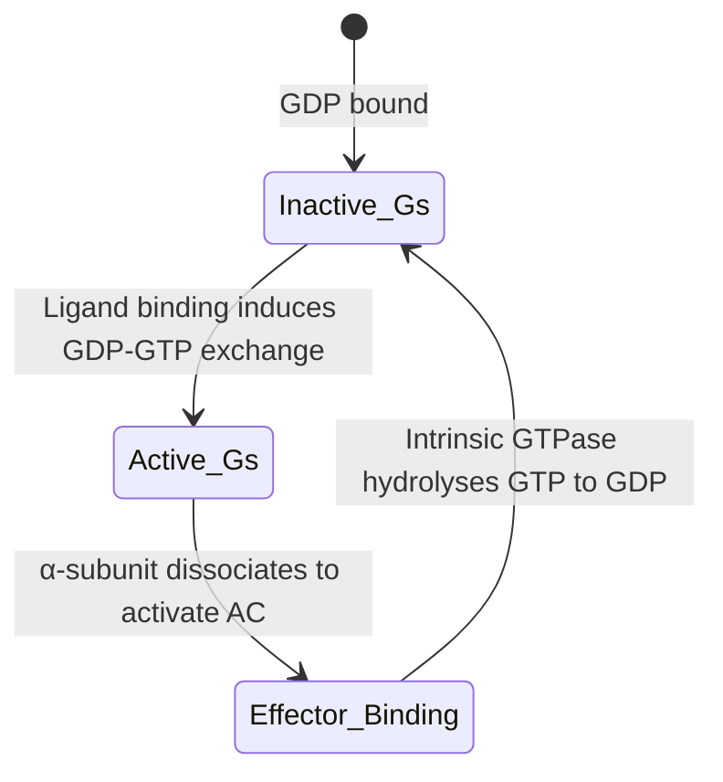
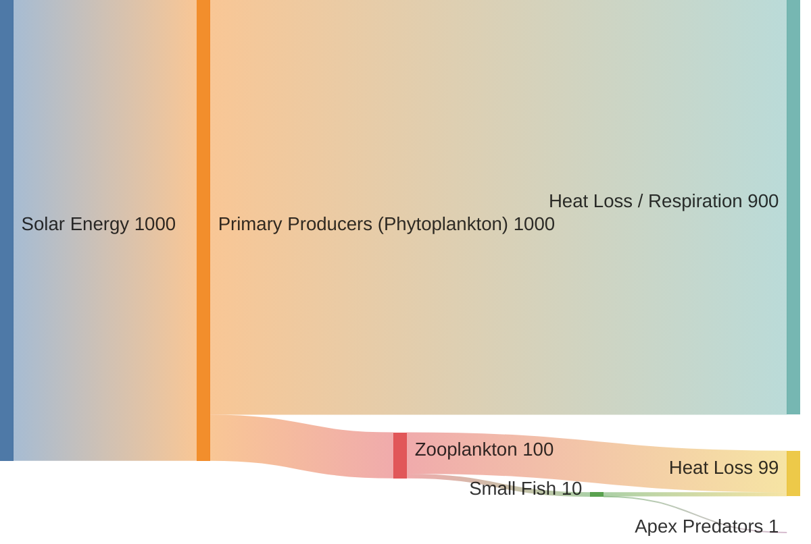

# 🧬 Mermaid Diagrams & Visualizations

Here are some examples of biological signalling cascades, metabolic cybernetics pathways, and research workflows constructed using **Mermaid.js**.

---

## 1. Adrenaline Signalling Pathway (Heart Rate Control)
Demonstrating G-protein-coupled receptor activation leading to physiological change.

---

## 2. Metabolic Feedback Control (Metabolic Cybernetics)
A negative feedback loop illustrating homeostasis.

---

## 3. Marine Trophic Energy Flow
Energy transfer across trophic levels in a marine ecosystem.

---

[⬅️ Back to Profile Overview](README.md)
